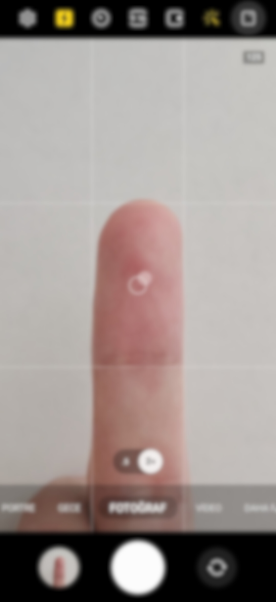
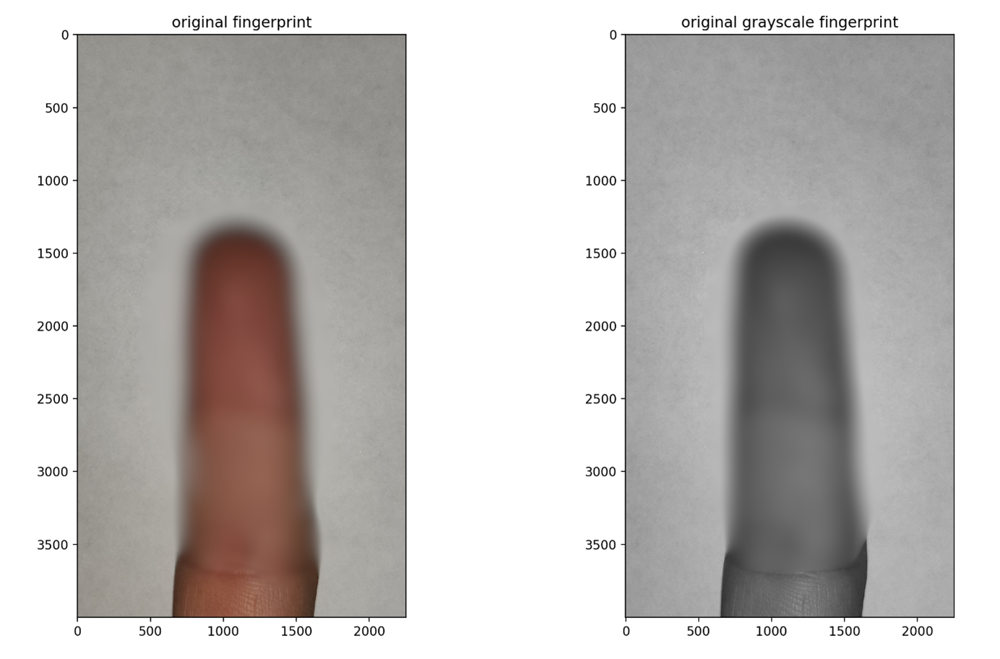
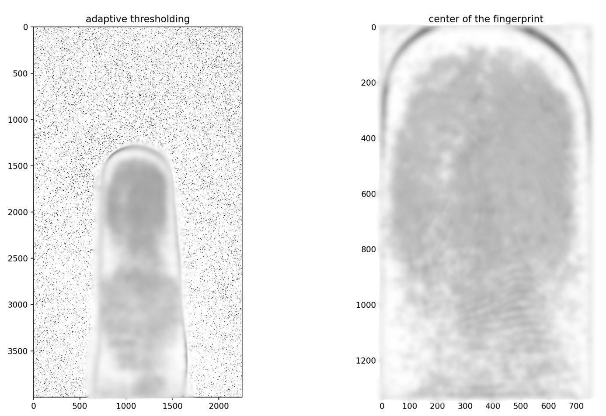
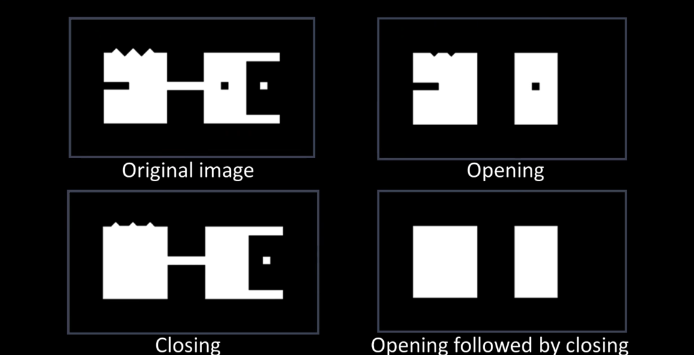

# 📌 Fingerprint Recognition Project

## 📜 Project Description
This project aims to develop a system that processes fingerprints captured with a mobile camera. By using image processing techniques, the fingerprints are filtered, matched, and analyzed.

## 🛠 Technologies Used
- **Python 3.x**
- **OpenCV** (Image processing)
- **Matplotlib** (Visualization)
- **NumPy** (Array operations)
- **PIL (Pillow)** (Reading/editing images)

## 📂 Directory Structure
- `200104004067.py` → Main code file.  
- `examples/` → Fingerprint images (hidden).  
- `README.md` → Project documentation.
- `LICENSE` → MIT Licence.

## 📸 How to Take Photos
- Place your finger in the center rectangle.


## 📜 Functions Used
- `load_image(image_path)`: Loads the image from the specified path, converts it to grayscale, and rotates it if needed based on EXIF data.


## 🖼 Image Processing
- `apply_bilateral_filter(image, d, sigma_color, sigma_space)`: Applies an edge-preserving bilateral filter to reduce noise in the fingerprint image.  
- `apply_adaptive_threshold(image)`: Applies adaptive thresholding to the grayscale image to highlight fingerprint details.
- `extract_center(image)`: Crops the central region of the image, focusing on the most relevant part of the fingerprint.


- `apply_morphological_operations(image, kernel_size, iterations)`: Performs morphological opening and closing to sharpen fingerprint ridges.



## 🔍 Fingerprint Matching
- SIFT (Scale-Invariant Feature Transform) to extract features.
- FLANN (Fast Library for Approximate Nearest Neighbors) for feature matching.
- Calculates a similarity score to determine if two fingerprints match.
- Produces a result image showing matched keypoints.

## 🏗 Setup and Run
1. Install required libraries:
   ```
   pip install opencv-python numpy matplotlib pillow
   ```

2. Run the `200104004067.py` file to perform image processing:
   ```
    python 200104004067.py
   ```

## ⚠️ Security and Data Privacy
- The fingerprint images used in this project are personal data and have not been publicly shared.
- The `examples/` folder contains blurred versions of real fingerprint images.

## 📜 License
This project is licensed under the MIT License. For details, please refer to the LICENSE file.